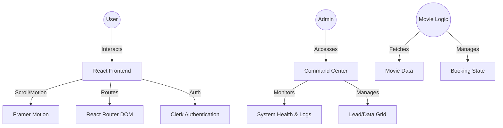

# 🚀 WebRev Studio: Premium Agency & Media Ecosystem

[](https://react.dev/)
[](https://vitejs.dev/)
[](https://tailwindcss.com/)
[](https://clerk.com/)

WebRev Studio is a high-end, futuristic digital ecosystem designed for enterprise-grade service delivery and media engagement. It seamlessly blends a cinematic agency landing page with a robust administrative "Command Center" and a comprehensive movie booking platform.

## 🌟 Overview
WebRev is built on the philosophy that **Design = Conversion**. It isn't just a landing page; it's a strategic digital storefront engineered for performance, visual storytelling, and seamless user interaction.

### The Problem It Solves
Most agency websites are static and generic. WebRev solves this by providing:
- **Cinematic Storytelling**: Moving beyond flat grids to scroll-driven narratives.
- **Enterprise Governance**: A powerful "Command Center" for managing leads and system health.
- **Service Diversification**: Integrated media booking (Movies) as a demonstration of high-performance complex state management.

---

## ✨ Key Features

### 🎬 Cinematic Frontend
- **Scroll-Driven Narrative**: Motion-based engagement patterns that reveal content progressively.
- **Glassmorphism UI**: Modern aesthetic with depth-based blur layers and ambient mesh gradients.
- **Dynamic Services Marquee**: Interactive, auto-scrolling service cards with touch support.
- **Conversion-Optimized UX**: Strategic CTA placements and zero-latency contact flows.

### 🛡️ WEBREV.SYS Command Center (Admin)
- **Live System Feed**: Real-time logging and system health monitoring (CPU, Memory, Latency).
- **Data Grid Management**: Advanced lead tracking with search, multi-sort, and bulk actions.
- **RBAC (Role-Based Access Control)**: Tiered clearance levels for Superadmins, Analysts, and Viewers.
- **Data Portability**: Secure export of system nodes in CSV and JSON formats.

### 🎟️ Movie Booking Platform
- **Comprehensive Catalog**: Browse movies with high-fidelity UI.
- **Seat Selection Engine**: Interactive seat layout for real-time booking simulations.
- **User Engagement**: "Favorite" system and booking history tracking.

---

## 🏗 System Architecture



---

## 🛠 Tech Stack

| Layer | Technology |
| :--- | :--- |
| **Framework** | [React 19](https://react.dev/) (Vite) |
| **Styling** | [Tailwind CSS 4](https://tailwindcss.com/) |
| **Animations** | [Framer Motion](https://www.framer.com/motion/) |
| **Authentication** | [Clerk](https://clerk.com/) |
| **Icons** | [Lucide React](https://lucide.dev/) |
| **State/Routing** | React Router DOM |
| **Feedback** | React Hot Toast |

---

## ⚙️ Setup & Installation

### Prerequisites
- [Node.js](https://nodejs.org/) (v18 or higher)
- [npm](https://www.npmjs.com/) or [yarn](https://yarnpkg.com/)

### 1. Clone the Repository
```bash
git clone https://github.com/santanu949/webrev-studio.git
cd webrev-studio
```

### 2. Install Dependencies
```bash
npm install
```

### 3. Environment Configuration
Create a `.env` file in the root directory and add your keys:
```env
VITE_CLERK_PUBLISHABLE_KEY=your_clerk_key
VITE_API_URL=https://script.google.com/macros/s/.../exec
```

### 4. Run Development Server
```bash
npm run dev
```
The application will be available at `http://localhost:5173`.

---

## 📖 Usage Guide

### For Visitors
1. **Explore**: Scroll through the Home page to experience the cinematic storytelling.
2. **Services**: Interact with the services marquee to see specialized agency offerings.
3. **Book Movies**: Navigate to `/movies` to explore the media booking platform.

### For Administrators
1. **Access**: Navigate to `/admin` (Requires Clerk authentication and appropriate role).
2. **Command Center**: Monitor live system logs and hardware metrics.
3. **Lead Management**: Use the Data Grid to review, verify, or archive inbound inquiries.
4. **Export**: Use the JSON/CSV buttons to extract lead data for offline analysis.

---

## 📈 Current Status
- **Landing Page**: Fully Implemented (Production Ready).
- **Admin Dashboard**: Fully Implemented (Enterprise Features Active).
- **Movie Booking**: Functional (In active development for payment gateway integration).

---

<div align="center">
  <p>© 2026 WebRev Studio. Built for innovation.</p>
</div>
